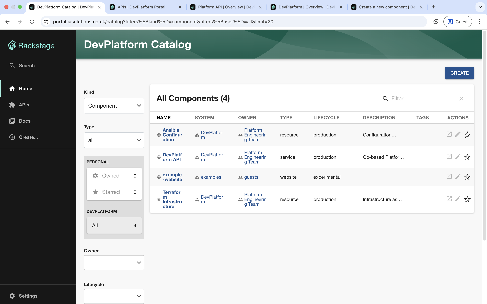
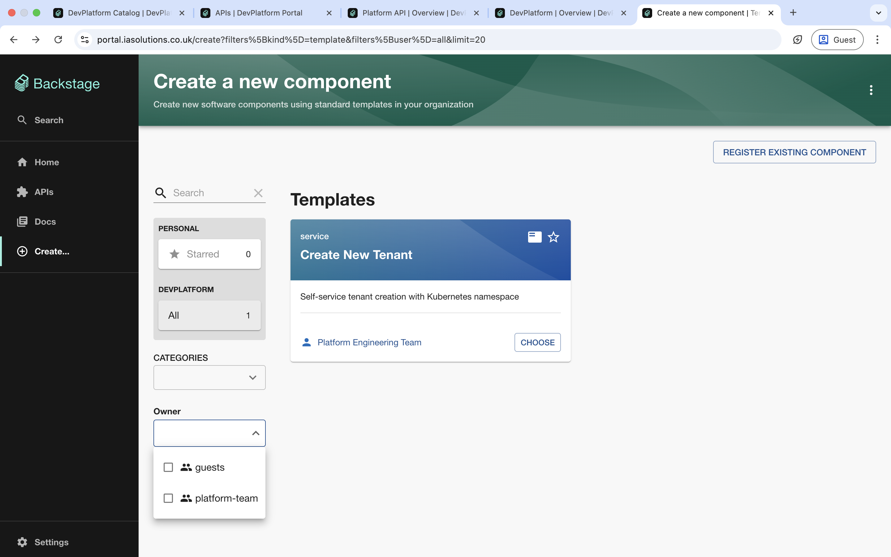
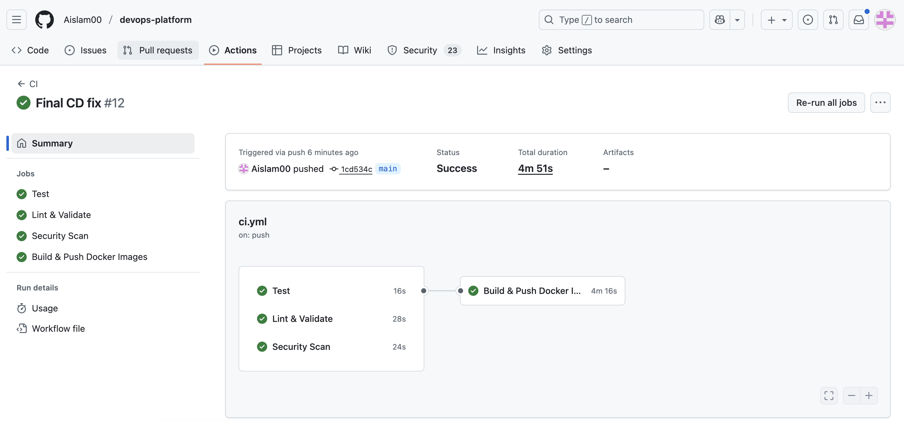
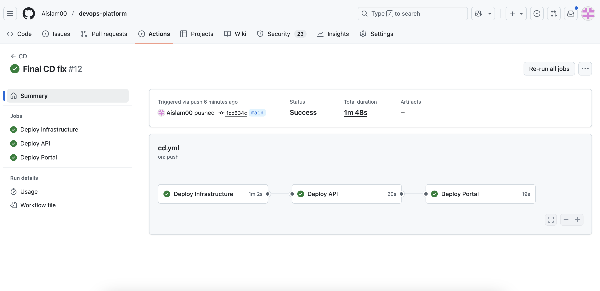

# DevPlatform - Self-Service Developer Platform

**Built with:** AWS EKS, Terraform, Backstage, Go, PostgreSQL, GitHub Actions, Prometheus/Grafana

A production-ready Internal Developer Platform (IDP) that enables teams to provision environments and deploy applications without requiring deep Kubernetes knowledge.

**Live URLs:**
- Portal: https://portal.iasolutions.co.uk/
- API: https://api.iasolutions.co.uk/
- Grafana: https://grafana.iasolutions.co.uk/
- Prometheus: https://prometheus.iasolutions.co.uk/

## About Me

**Alamin Islam**  
💼 LinkedIn: [linkedin.com/in/alamin-islam-58a635300](https://www.linkedin.com/in/alamin-islam-58a635300)  
🌐 Portfolio: [github.com/Aislam00](https://github.com/Aislam00)

## What it does

This is an Internal Developer Platform (IDP) that solves a fundamental problem in enterprise engineering: **developer velocity vs operational control**. Instead of developers waiting days or weeks for platform teams to provision infrastructure, they can self-serve environments through a web portal while maintaining security guardrails and cost controls.

**Enterprise Context:**
This represents what a senior platform engineer would build for a mid-to-large enterprise. Companies like Netflix, Spotify, Airbnb, and Uber have similar internal platforms that cost millions to develop and maintain. This implementation provides 80% of the functionality at a fraction of the cost using open-source tools.

**Real-World Comparison:**
- **Similar to Vercel/Netlify** - But for internal enterprise applications on Kubernetes
- **Like AWS Control Tower** - But focused on developer self-service rather than account management
- **Comparable to Platform.sh** - But with full infrastructure control and customization
- **Enterprise alternative to Heroku** - With cost optimization and security compliance

**Key Problems Solved:**
- **Ticket-driven infrastructure** - Eliminates manual provisioning requests
- **Knowledge silos** - Developers don't need Kubernetes expertise
- **Resource sprawl** - Centralized tracking and governance
- **Security consistency** - Standardized, compliant environments
- **Cost visibility** - Resource tracking across teams and projects

## Live Demo


## Getting it running

```bash
# Set up Terraform backend
cd terraform/backend && terraform init && terraform apply

# Deploy infrastructure
cd ../environments/dev && terraform init && terraform apply

# Configure kubectl
aws eks update-kubeconfig --region eu-west-2 --name devplatform-dev

# Build and deploy applications
cd platform-api
docker build --platform linux/amd64 -t platform-api:latest .
docker push YOUR_ACCOUNT.dkr.ecr.eu-west-2.amazonaws.com/platform-api:latest

cd ../backstage/portal
yarn workspace backend build
docker build --platform linux/amd64 -t devplatform-portal:latest .
docker push YOUR_ACCOUNT.dkr.ecr.eu-west-2.amazonaws.com/devplatform-portal:latest

# Deploy to Kubernetes
kubectl apply -f k8s/
```

## Platform Architecture


**Architecture Pattern:**
This follows the "Platform as a Product" model where the platform team provides developer-facing APIs and interfaces while abstracting away infrastructure complexity. The Backstage frontend provides the developer experience while the Go API handles the operational complexity.

**Core Components:**
- **Backstage Portal** - Spotify's open-source developer portal for self-service
- **Platform API** - Go backend that translates developer requests into Kubernetes operations
- **PostgreSQL** - State tracking for environments, deployments, and resource allocation
- **EKS Cluster** - Production Kubernetes with proper security and networking
- **Monitoring Stack** - Prometheus/Grafana for observability and cost tracking

## Developer Self-Service Templates


*Template catalog for common deployment patterns*


*Environment provisioning with automated setup*

**Available Templates:**
- **Web Applications** - React/Vue.js frontends with CDN and SSL
- **API Services** - Node.js/Python/Go backends with database connectivity
- **Microservices** - Service mesh integration with monitoring
- **Data Processing** - Batch jobs and ETL pipelines
- **Development Environments** - Temporary testing environments with automatic cleanup

**Enterprise Benefits:**
- **Standardization** - All environments follow security and compliance policies
- **Self-service** - Developers get environments in minutes, not weeks
- **Cost control** - Automatic resource limits and cleanup policies
- **Governance** - Audit trails and approval workflows for production

## CI/CD Pipelines


*Infrastructure validation and application building*


*Automated deployment with safety controls*

**Pipeline Philosophy:**
Follows GitOps principles with infrastructure and applications managed as code. Separates validation (CI) from deployment (CD) with proper approval gates for production changes.

## Monitoring


*Real-time metrics and cost tracking*


*Multi-tenant visibility and resource utilization*

Enterprise-grade monitoring with cost allocation, resource utilization tracking, and automated alerting for policy violations.

## Enterprise Value Proposition

**For Development Teams:**
- Deploy applications without Kubernetes knowledge
- Get environments in ~10 minutes instead of weeks
- Focus on business logic rather than infrastructure
- Consistent development/staging/production environments

**For Platform Teams:**
- Reduce operational toil through automation
- Enforce security and compliance policies
- Gain visibility into resource usage and costs
- Scale platform capabilities without scaling team size

**For Engineering Leadership:**
- Accelerate time-to-market for new features
- Reduce infrastructure costs through standardization
- Improve security posture through consistent policies
- Enable data-driven capacity planning

## Technical Implementation

This project demonstrates the core architectural patterns and technical decisions required for enterprise platform engineering. It shows how modern tools like Backstage, Kubernetes, and Terraform can be integrated to create developer-centric platforms that maintain operational control and security compliance.

The implementation addresses real enterprise challenges: multi-tenancy, cost optimization, security policies, and developer productivity - the same problems that platform engineering teams at Fortune 500 companies solve daily.