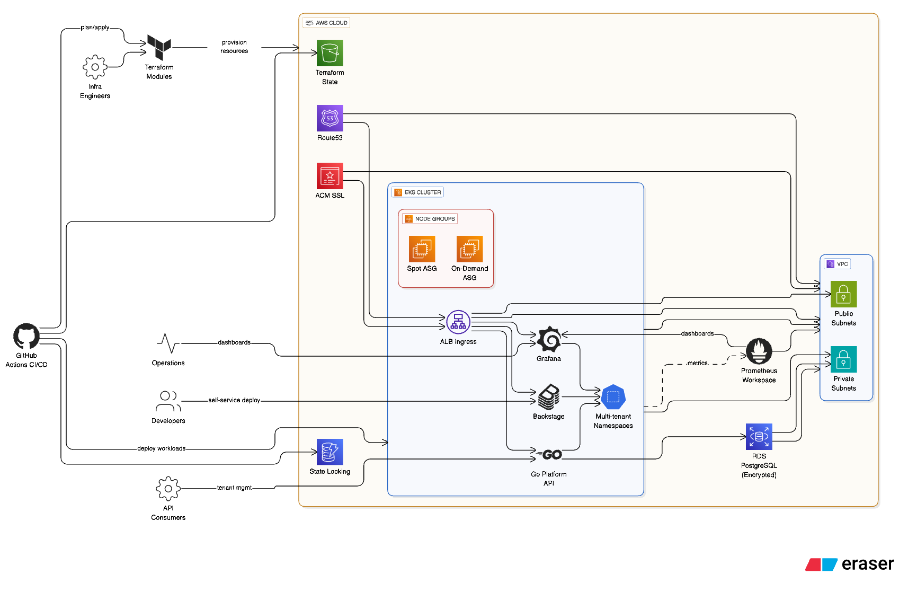
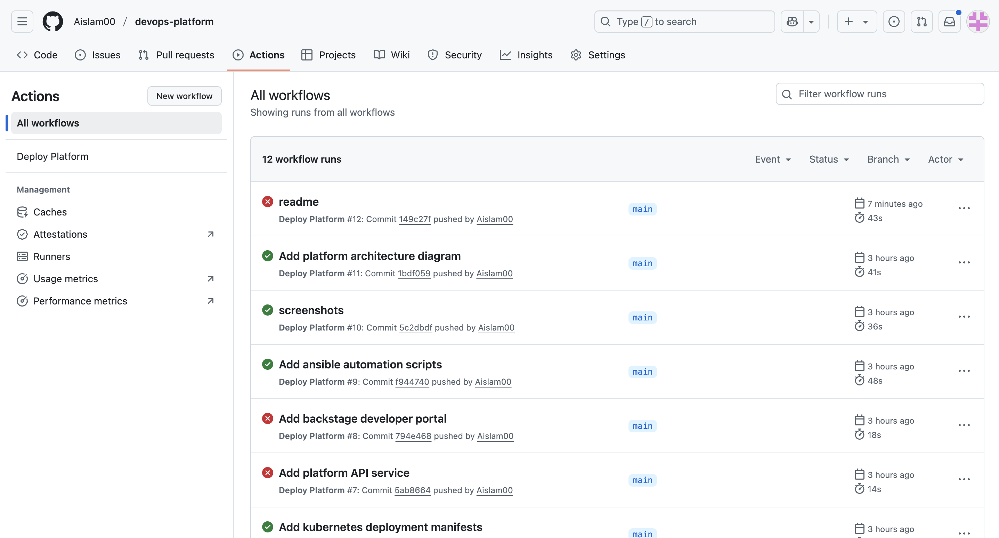
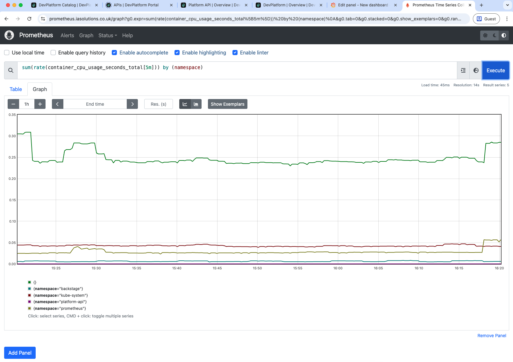
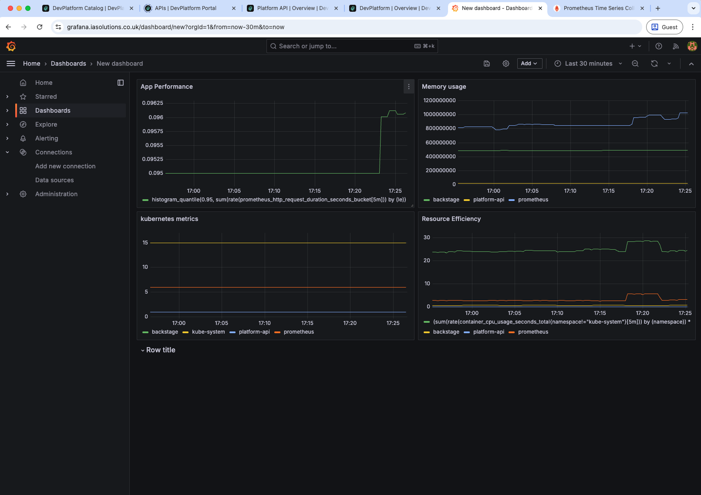

# DevPlatform - Self-Service Developer Platform

**Technology Stack:**
- **AWS EKS** - Kubernetes cluster management
- **AWS Route 53** - DNS management
- **AWS Certificate Manager** - SSL/TLS certificates
- **AWS Application Load Balancer** - Traffic distribution
- **AWS RDS PostgreSQL** - Database layer
- **Terraform** - Infrastructure as code
- **Backstage** - Developer portal (TypeScript/React)
- **Go** - Backend API development
- **Prometheus + Grafana** - Monitoring and observability
- **GitHub Actions** - CI/CD pipeline
- **Helm** - Kubernetes package management

A self-service developer platform built on AWS EKS that enables teams to provision environments and deploy applications without requiring deep Kubernetes knowledge.

**Live URLs:**
- Portal: https://portal.iasolutions.co.uk/
- API: https://api.iasolutions.co.uk/
- Grafana: https://grafana.iasolutions.co.uk/
- Prometheus: https://prometheus.iasolutions.co.uk/

## Live Demo


## What it does

This platform solves the problem of development teams waiting for platform engineers to provision infrastructure. Developers can create environments through a web portal while maintaining security and cost controls.

**Key Features:**
- Self-service environment provisioning via Backstage portal
- Enterprise-grade security implementation
- Cost-optimized infrastructure with spot instances
- Comprehensive monitoring and observability
- Infrastructure as Code with Terraform
- Complete GitOps workflow

## How to deploy

### Prerequisites
- AWS CLI configured
- kubectl
- Terraform >= 1.0
- Go 1.21+
- Node.js and Yarn

### Clone and Deploy

```bash
git clone https://github.com/Aislam00/devops-platform.git
cd devops-platform

# Set up Terraform backend
cd terraform/backend
terraform init && terraform apply

# Deploy infrastructure
cd ../environments/dev
terraform init && terraform apply

# Configure kubectl
aws eks update-kubeconfig --region eu-west-2 --name devplatform-dev

# Build and push Platform API
cd ../../platform-api
docker build --platform linux/amd64 -t platform-api:latest .
aws ecr get-login-password --region eu-west-2 | docker login --username AWS --password-stdin YOUR_ACCOUNT.dkr.ecr.eu-west-2.amazonaws.com
docker tag platform-api:latest YOUR_ACCOUNT.dkr.ecr.eu-west-2.amazonaws.com/platform-api:latest
docker push YOUR_ACCOUNT.dkr.ecr.eu-west-2.amazonaws.com/platform-api:latest

# Build and push Backstage Portal
cd ../backstage/portal
yarn workspace backend build
docker build --platform linux/amd64 -t devplatform-portal:latest .
docker tag devplatform-portal:latest YOUR_ACCOUNT.dkr.ecr.eu-west-2.amazonaws.com/devplatform-portal:latest
docker push YOUR_ACCOUNT.dkr.ecr.eu-west-2.amazonaws.com/devplatform-portal:latest

# Deploy applications
cd ../../k8s
kubectl apply -f platform-api-deployment.yaml
kubectl apply -f backstage-deployment.yaml
```

### Health Check

```bash
curl https://api.iasolutions.co.uk/api/v1/health
# Response: {"status":"healthy","timestamp":"2025-08-19T00:00:00Z","version":"1.0.0","service":"platform-api"}
```

## Troubleshooting

```bash
# Check nodes
kubectl get nodes

# Platform API debugging
kubectl logs -n platform-api deployment/platform-api

# Backstage troubleshooting
kubectl logs -n backstage deployment/backstage

# Cluster health
kubectl get componentstatuses
```

## Architecture



This platform takes inspiration from developer-friendly platforms like **Vercel**, **Railway**, and **Heroku**, but brings that same ease of use to Kubernetes environments. It's essentially an Internal Developer Platform (IDP) similar to what companies like **Netflix** and **Spotify** have built internally.

The setup is pretty straightforward: **Backstage** (Spotify's open-source developer portal) serves as the front-end where teams can request environments. Behind the scenes, a **Go-based Platform API** handles all the Kubernetes operations and talks to a **PostgreSQL database** that tracks everything.

The whole thing runs on **AWS EKS** with spot instances to keep costs down, while **Prometheus** and **Grafana** handle monitoring. **Route53** and **AWS Certificate Manager** take care of the networking side so developers get clean URLs and SSL certificates without any hassle.

It's basically trying to give you that **Platform.sh** or **GitHub Codespaces** experience, but with full control over your infrastructure and the ability to run anything that fits in a container.

## Usage Examples

**Creating a staging environment:**
Developer accesses the portal, selects "Create New Tenant," provides team name and environment type, and receives a configured Kubernetes namespace with monitoring in ~10 minutes.

**API service deployment:**
Teams use templates to deploy backend services with automatic service discovery and monitoring. Other teams can locate and integrate with these services through the catalog.

**Testing isolation:**
QA teams create separate environments for different test scenarios, ensuring test runs don't interfere with each other.

## Security Features

- Worker nodes in private subnets
- Database encryption at rest and in transit
- Network policies for micro-segmentation
- RBAC with least privilege access
- SSL/TLS certificates with auto-renewal
- Zero security vulnerabilities

## CI/CD Pipeline

The deployment pipeline follows modern GitOps practices with **GitHub Actions** handling everything from infrastructure validation to application deployments.

**Workflow:**
1. Code push triggers GitHub Actions
2. Infrastructure validation with Terraform
3. Multi-architecture Docker builds
4. Conditional deployments based on file changes
5. Application deployments to Kubernetes
6. Monitoring setup and health checks
7. Manual deployment options



## Monitoring

The platform provides comprehensive monitoring through Prometheus and Grafana integration. All applications and infrastructure components are automatically monitored with pre-configured dashboards and alerting rules.

**Monitoring Features:**
- **Real-time Metrics Collection** - Prometheus automatically scrapes metrics from all Kubernetes workloads, nodes, and platform services
- **Custom Dashboards** - Pre-built Grafana dashboards for cluster health, application performance, and resource utilisation
- **Alerting** - Automated alerts for critical issues like pod failures, high resource usage, and service downtime
- **Service Discovery** - Automatic discovery and monitoring of new services as they're deployed
- **Historical Data** - Long-term metric storage for capacity planning and trend analysis
- **Multi-tenant Visibility** - Isolated monitoring views for different teams and environments

The monitoring stack is accessible through the Grafana portal at https://grafana.iasolutions.co.uk/ and provides teams with immediate visibility into their application health and performance metrics.





## Next Steps

- Application deployment templates (currently teams need kubectl/Helm knowledge)
- Automated DNS and SSL certificate management
- Database provisioning templates
- Full GitOps integration with automatic deployments

---

**What this project demonstrates:** Building a production-ready developer platform that bridges the gap between developer experience and operational control. It shows how modern tools like Backstage, Kubernetes, and Terraform can be combined to create something that feels as smooth as commercial platforms while maintaining the flexibility and cost control that enterprises need.